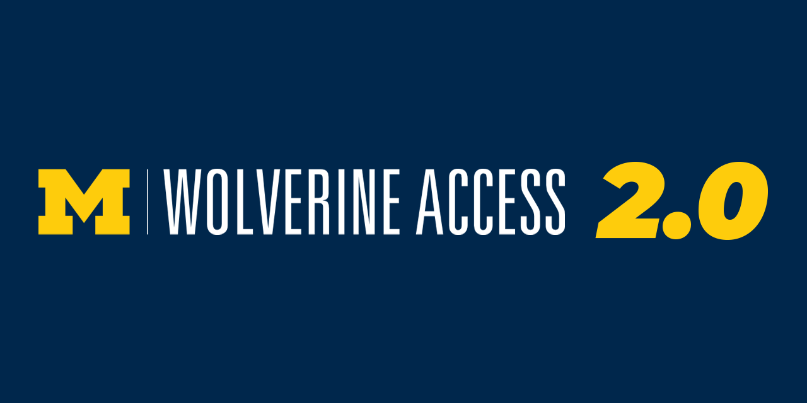

# WolverineAccess _(wolverine-access)_




WolverineAccess is a modern, user-friendly portal designed to enhance the digital experience for students, faculty, and staff by providing a seamless and efficient interface inspired by the University of Michigan's Wolverine Access.

## Table of Contents

- [Background](#background)
- [Features](#features)
- [Install](#install)
  - [Dependencies](#dependencies)
- [Usage](#usage)
  - [Common Operations](#common-operations)
- [Contributing](#contributing)
- [Credits](#credits)

## Background

The University of Michigan's current portal, [Wolverine Access](https://wolverineaccess.umich.edu), serves as a central hub for accessing various university services. Recognizing the need for a more modern and intuitive version to meet evolving user needs and leverage the latest web technologies, WolverineAccess was developed as an independent project to provide an enhanced user experience without any affiliation to the University of Michigan.

## Features

- **Responsive Design:** Ensures optimal viewing across a wide range of devices.
- **Intuitive Navigation:** Easy access to essential services and information.
- **Favorites Management:** Allows users to bookmark and manage their favorite links.
- **Group Selector:** Tailors content based on user roles such as Student, Faculty & Staff, Parents & Family, Alumni, and All.
- **Notifications:** Keeps users informed with real-time updates.
- **Search Functionality:** Enables quick and efficient searching within the portal.
- **User Authentication:** Secure sign-in process for personalized access.

## Install

### Dependencies

Before installing, ensure you have the following installed on your machine:

- [Node.js](https://nodejs.org/) (v14 or higher)
- [npm](https://www.npmjs.com/) (comes with Node.js)
- [VSCode Live Server Extension](https://marketplace.visualstudio.com/items?itemName=ritwickdey.LiveServer) for running the project locally.

### Steps

1. **Clone the Repository**

   ```bash
   git clone https://github.com/yourusername/wolverine-access.git
   ```

2. **Navigate to the Project Directory**

   ```bash
   cd wolverine-access
   ```

3. **Install Dependencies**

   ```bash
   npm install
   ```

4. **Start the Development Server**

   ```bash
   npm start
   ```

## Usage

After installing and starting the development server, you can access WolverineAccess by navigating to [http://localhost:3000](http://localhost:3000) in your web browser.

### Common Operations

- **Searching:** Use the search bar in the navigation to find specific services or information.
- **Managing Favorites:** Click the star icon next to any link to add or remove it from your favorites.
- **Group Selection:** Use the group selector to customize the portal based on your role.
- **Notifications:** Click the notifications icon to view recent updates and alerts.
- **Sign In:** Use the sign-in button to access personalized features and settings.

## Contributing

Contributions are welcome! Please follow these steps to contribute to WolverineAccess:

1. **Fork the Repository**

   Click the “Fork” button at the top-right corner of the repository page.

2. **Clone Your Fork**

   ```bash
   git clone https://github.com/yourusername/wolverine-access.git
   ```

3. **Create a New Branch**

   ```bash
   git checkout -b feature/YourFeatureName
   ```

4. **Make Your Changes**

   Implement your feature or bug fix.

5. **Commit Your Changes**

   ```bash
   git commit -m "Add feature: YourFeatureName"
   ```

6. **Push to Your Fork**

   ```bash
   git push origin feature/YourFeatureName
   ```

7. **Open a Pull Request**

   Go to the original repository and click “Compare & pull request”.

Please ensure your contributions adhere to the project’s coding standards and guidelines. For major changes, please open an issue first to discuss what you would like to change.

## Credits

- **Original Developers:** The team behind the original Wolverine Access.
- **Current Copyright Holders:** &copy; 2024 [The Regents of the University of Michigan](http://regents.umich.edu/)
- **Project Maintainer:** [Kaden Gruizenga](https://github.com/kgruiz)
